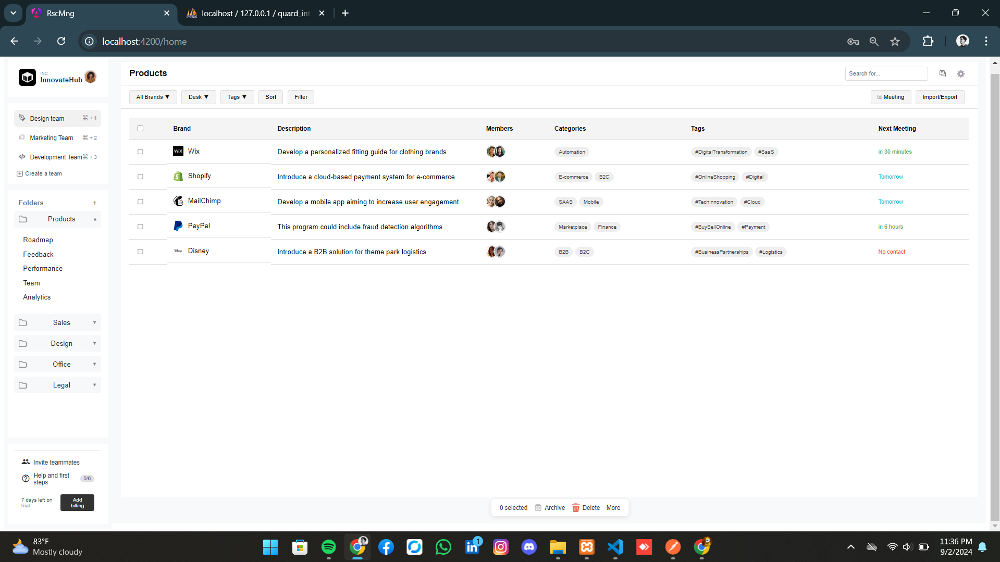

# Project Setup Guide



## What Have I Done

- ✅ Responsive UI to match the provided design
- ✅ Backend with Migration Files, Seeders, Models, and Controllers
- ✅ Proper API endpoints with \`POST\`, \`PUT\`, \`DELETE\`, \`GET\` requests
- ✅ Error codes, validations, and protected routes for CRUD operations
- ✅ Unit tests for Autthentication Logic
- ✅ Sanctum for token-based authentication and password hashing
- ✅ Complete CRUD operations implemented in both frontend and backend
- ✅ [POSTMAN COLLECTION FILE](https://drive.google.com/drive/folders/1cmEjtGzptA4-Lp0TJNKjvxqqrdPmcvBt?usp=sharing)
- ✅ Version control with Git

## Angular Frontend Setup

1. **Clone the repository:**
   ```
   git clone https://github.com/shaheerk1/quard_intl.git
   ```
2. **Navigate to the project directory:**
   ```
   cd quard_intl
   ```
3. **Install dependencies:**
   ```
   npm install
   ```
4. **Start the development server:**
   ```
   ng serve
   ```

## Laravel Backend Setup

1. **Clone the repository:**
   ```
   git clone https://github.com/shaheerk1/quard_intl_backend.git
   ```
2. **Navigate to the project directory:**
   ```
   cd quard_intl_backend
   ```
3. **Install dependencies:**
   ```
   composer install
   ```
4. **Copy the `.env` file and configure it:**
   ```
   cp .env.example .env
   ```
   - Set up your database and other environment variables in the `.env` file.
5. **Generate application key:**
   ```
   php artisan key:generate
   ```
6. **Run migrations and seed the database:** creates the tables and create an initial user
credentials - email: test@mail.lk and password: 1234test

   ```
   php artisan migrate --seed
   ```
7. **Start the development server:**
   ```
   php artisan serve
   ```

